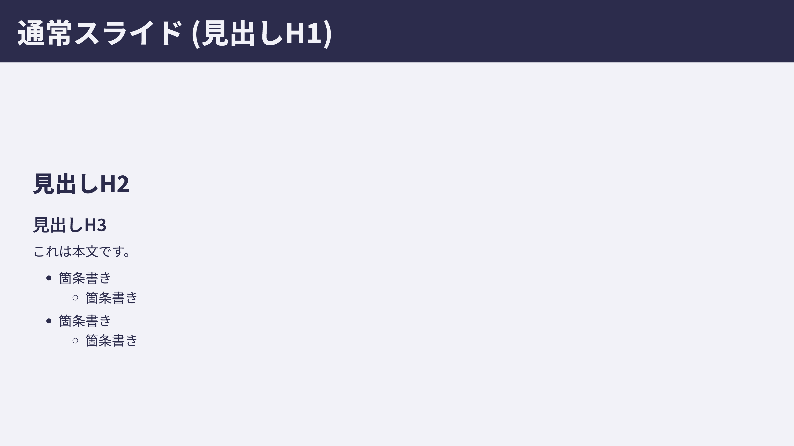
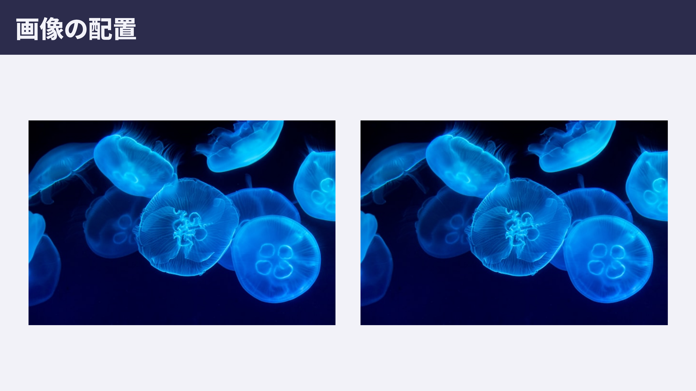
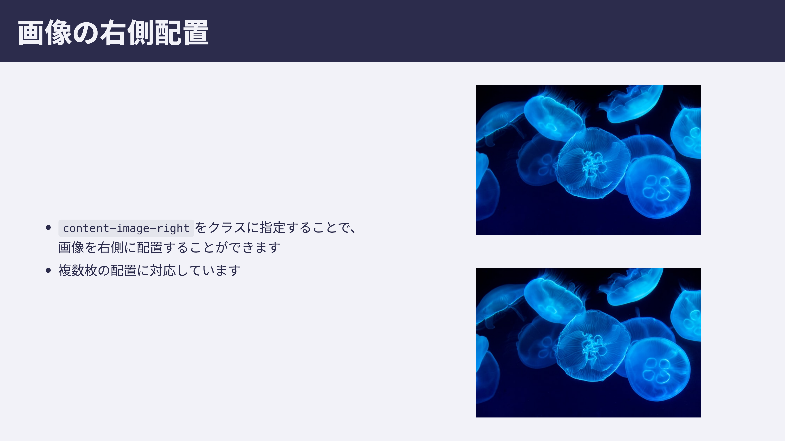

# fukui

高専プロコンで作成したスライドをベースに作成したテーマです。

| 種類               | 例                                                                           |
| ------------------ | ---------------------------------------------------------------------------- |
| タイトルスライド   |    |
| 通常スライド       |        |
| 画像スライド       |        |
| 画像スライド(分割) |  |

## タイトルスライド

以下のように記述することでタイトルスライドを作成することができます。

```markdown
<!-- _class: lead -->

# marp-themes

## by ちょこみんと

Marp用のカスタムテーマです。テスト用のスライドです。
これは表紙のスライドです。
```

## 画像スライド

画像を複数枚配置すると自動で横並びに表示されます。

```markdown
# 画像の配置


```

## 画像スライド(分割)

以下のように記述することで文章と画像を左右に分割したスライドを作成することができます。

```markdown
<!-- _class: content-image-right -->

# 画像の右側配置

- `content-image-right`をクラスに指定することで、
  画像を右側に配置することができます
- 複数枚の配置に対応しています


```
